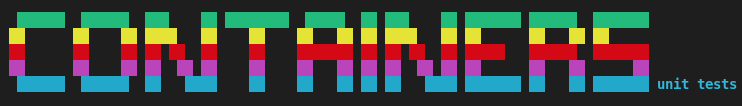
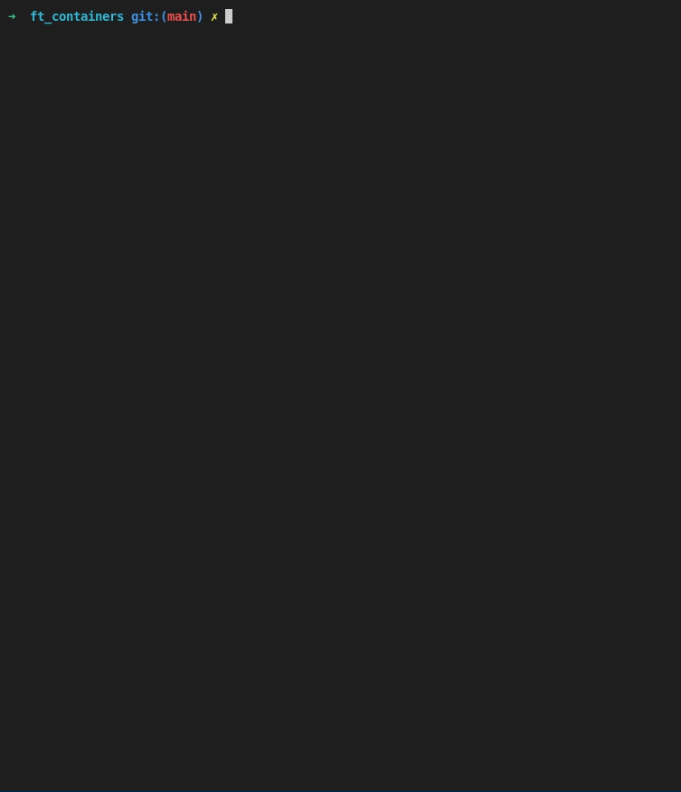

# Containers Unit Tests



This is a tester for the [42](https://42.fr/en/homepage/) project [ft_containers](https://github.com/valentinllpz/ft_containers). It will test `vector`, `stack` and `map` with random values and compare the output with STL containers. The time used by both will also be displayed.
You can run heavier tests by editing the MAX_SIZE macro in .cpp files. 

If any diff or error happens, log files will be kept, so you can have look and understand what you got wrong.

## 🧭 Usage

1. Clone this repo in your ft_container directory and access it with `cd`
2. Use `./run_tests.sh` to test everything.
3. If you only want to test one container, the first argument should be `vector`, `stack` or `map`.
Example: `./run_tests.sh vector`

Note: The path by default is the parent folder. You can edit the path to your containers in `run_tests.sh`:
```
vector_path='..'
map_path='..'
stack_path='..'
```

# ▶️ Demo


